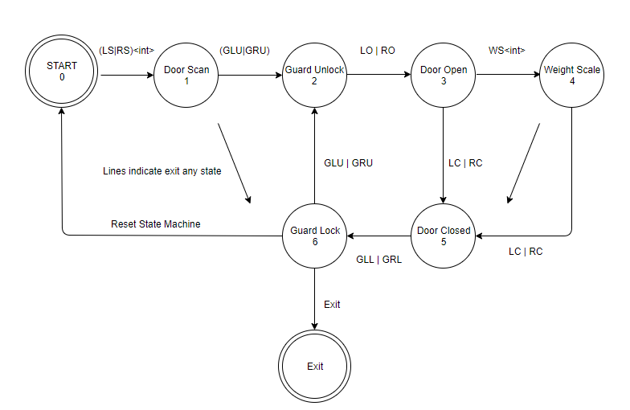
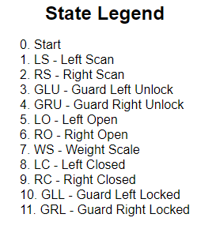

  
  
  

The DES is a Door Entry System simulating an inbound/outbound security passthrough system. The sequence of events are driven by user input and using QNX native message passing to drive the finite state machine. 

DES Scenario
User approaches door and scans their id. On validation, Guard unlocks the door and door opens. 
User enters the weight scale, provides their weight and Guard closes and locks the door behind them.
Guard unlocks the outbound door, door opens, user exits and has passed through the DES.
Guard closes and locks the door behind them.

Here is the expected sequence of events
Inbound 
LS, GLU, LO, WS, LC, GLL, GRU, RO, RC, GRL, Machine Reset.

Outbound 
RS, GRU, RO, WS, RC, GRL, GLU, LO, LC, GLL, Machine Reset.

