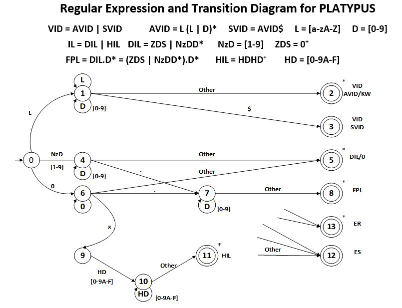

This was one of my favorite project assigned, and really guided me to becoming a more thoughtful programmer. Through learning the process of what and how a compiler processes languages. Really putting emphasis on designing finite state machines, understanding DFA (Deterministic Finite Automaton) and NFA (Non-Deterministic Finite Automaton), building parse and syntax trees, and using regular expressions for the lexical analysis and BNF (Backus-Naur Form) for the syntactical analysis associated with our grammar.

I was tasked with building a front end compiler written in ANSI C. For a user defined language called platypus. The front end aspect of 
a compiler consists of the lexical analyzer, syntax analyzer and semantic analyzer. 

The buffer was the start point, as we needed a buffer to hold the stream of characters which were to be read by the compiler. The buffer also contained all the buffer control functions necessary to traverse and manipulate the buffer.

The buffer consisted of three different buffer modes, a fixed-size, additive, or multiplicative buffer. 
The choice mode is read from the command line and proceeds to create the buffer at runtime and dynamically allocates it's memory accordingly.

With this stage completed we had our first step into a compiler, a buffer to hold all the characters read from the input file.
Now that we have our container we need to implement the Lexical Analyzer also known as the Scanner.

The Scanner is used to produce tokens based off of streams of characters inside the buffer. With this knowledge we use a transition diagram to process each character in the buffer. Upon reaching an accepting state the scanner then consumes the stream of characters and produces and replaces with token for the parser to use later.

  

At this point we have a buffer to hold characters, scanner to read the buffer and produce tokens. We just need to implement the syntax analyzer also known as the parser. to confirm if the source code being compiled is syntactically correct or not.

The parser for this language is a RDPP or Recursive Descent Predictive Parser. Our grammar was written for a LR bottom up parser. With this the first task was to transform the grammar into a LL parser. This example will show you how I transformed the string expression grammar. 

  

With this we now know how our compiler should be syntactically. The parser consists of grammar production functions, error handling, accepting state functions correlated to the state machine and the parsers token match tool which is used to match the tokens generated from the scanner to the parsers lookahead token to correctly determine if the code is syntactically correct.

Below is the parsers match function, which attempts to match the token to the lookahead token.

  

